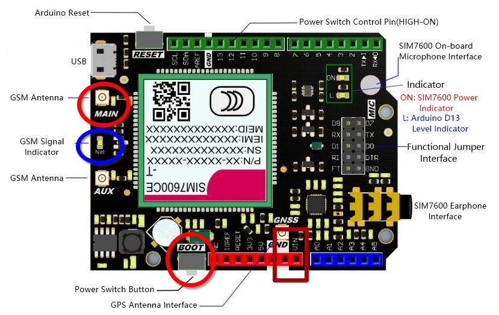

# Automatic doorman for the mosque of Gland

Automatique door opener for the mosque of Gland (CCMN).

## Raspberry Pi variant

- Raspberry Pi Zero 2 W
- [SIM7600G-H_4G_HAT](https://www.waveshare.com/wiki/SIM7600G-H_4G_HAT_(B)#Feature)
- USB to micro-USB cable
- 5V/2A power supply

### Setup

fix the physical contact issue between pi zero and HAT (I used a copper cushion to increase the contact surface between the pogo pins and the pi 0)

```sh
sudo -i

# Disable ModemManager because it uses /dev/ttyUSB2
systemctl disable --now ModemManager

# Install dnsmasq and hostapd
apt install dnsmasq hostapd
systemctl stop dnsmasq hostapd

# Give static IP to wlan0
cat << EOF >> /etc/network/interfaces
auto wlan0
iface wlan0 inet static
  address 192.168.4.1
  netmask 255.255.255.0
EOF

# Configure the DHCP server
cat << EOF >> /etc/dnsmasq.conf
interface=wlan0
dhcp-range=192.168.4.2,192.168.4.20,255.255.255.0,24h
EOF

# Create the file /etc/hostapd/hostapd.conf with the one provided here

# Specify the configuration file location
cat << EOF >> /etc/default/hostapd
DAEMON_CONF="/etc/hostapd/hostapd.conf"
EOF
```

Switch to AP mode

```sh
sudo -i

systemctl enable dnsmasq hostapd
systemctl mask wpa_supplicant
systemctl restart networking dnsmasq hostapd
```

Place the `portier.service` file in `/etc/systemd/system/` and the python script `portier.py` in `/home/pi/`

And enable it:

```sh
sudo -i

systemctl daemon-reload
systemctl enable --now portier.service
```

## Arduino variant

- An Arduino Uno
- The phone SIM hat [SIM7600CE-T_4G](https://wiki.dfrobot.com/SIM7600CE-T_4G(LTE)_Shield_V1.0_SKU_TEL0124) for Arduino. Purchased on [Mouser](https://eu.mouser.com/ProductDetail/DFRobot/TEL0124?qs=17u8i%2FzlE88MEbXRJuYFsA%3D%3D)
- The SIM card used by the genuine mosque's phone

The device waits indefinitely for phone call and does this series of actions every time:

1. Answer to phone call
2. Wait a bit
3. Send DTMF code **#61**
4. Wait a bit
5. Hang up phone call
6. Listen and wait again for new phone calls

### Usage



Place the SIM card at the back of the SIM7600 device (you will probably need a SIM card adaptator).

Connect the hat on top of the Arduino Uno and connect the antenna to the **MAIN** port.

Power up the device by delevering **(7-23)V/2A** on pins **VIN** and **GND**.

Press the **BOOT** button for at least one second and release it. Wait for the **GSM Signal Indicator LED** to blink. Fix LED means that it's trying to connect to the network. Blinking LED means that it is connected and ready.

### Code setup

The easiest way to use this project is by using the official **Arduino IDE**.

However, you can follow theses instructions if you prefer to use VS Code.

### OS Dependencies

On Arch Linux, install these packages: `extra/arduino-avr-core` and `extra/arduino`

### VS Code extension

Open project with vscode

```sh
code .
```

install the [Arduino extension](https://marketplace.visualstudio.com/items?itemName=vsciot-vscode.vscode-arduino).

Initialize the extension for **Arduino Uno** with vscode command `Arduino: initialize`

### Ressources

- [AT command manual](https://www.waveshare.com/w/upload/a/af/SIM7500_SIM7600_Series_AT_Command_Manual_V3.00.pdf)
- [Wiki DFRobot](https://wiki.dfrobot.com/SIM7600CE-T_4G(LTE)_Shield_V1.0_SKU_TEL0124)
- [Entering commands during phone call](https://stackoverflow.com/questions/51697783/how-to-enter-an-option-during-voice-calls-using-at-commands)
- [Serial comm issue with the module](https://forum.arduino.cc/t/no-flow-control-on-sim7600ce-t-4g-lte/879447)
- [Troubleshooting 1](https://www.waveshare.com/wiki/Template:SIM7600X_4G_HAT_FAQ)
- [Troubeshooting 2](https://forum.core-electronics.com.au/t/waveshare-sim7600x-h-4g-hat-with-arduino/18389/21?page=2)
